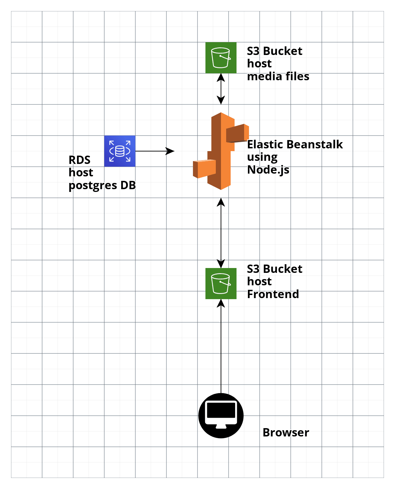

# Udagram

#### Pipeline Status(CircleCi):
[](https://circleci.com/gh/DrFarouk/udagram/tree/main)
[](https://circleci.com/gh/DrFarouk/udagram/tree/main)

I did This project as a part of the Udacity Advanced FullStack Nanodegree.
The purpose was deploying a full-stack Application on Amazon Web Servers &
use CircleCi as a pipeline for CI & CD


## Screenshots

### Elastic Beanstalk


### S3 Bucket


### PostgreSQL RDS database


### CircleCI Pipeline


### CircleCI Environment Variables


## Pipeline Process

monitored by CircleCi. when a new code is pushed to the GitHub, CircleCi is triggered

1. install Node, the AWS cli and the EB cli.
2. Configure AWS Credentials
3. install FrontEnd & BackEnd
4. build FrontEnd & BackEnd
5. deploy FrontEnd & BackEnd


## Infrastructure

AWS services

- **Elastic Beanstalk**
  - host the backend which is built using Node
- **RDS**
  - host PostgreSQL database
- **S3**
  - provides the frontend hosting
  - and backend media hosting



## App Dependencies

```
- Node v14.15.1 (LTS) or more recent. While older versions can work it is advisable to keep node to latest LTS version

- npm 6.14.8 (LTS) or more recent, Yarn can work but was not tested for this project

- AWS CLI v2, v1 can work but was not tested for this project

- A RDS database running Postgres.

- A S3 bucket for hosting uploaded pictures.

```

## Built With

- [Angular](https://angular.io/) - Single Page Application Framework
- [Node](https://nodejs.org) - Javascript Runtime
- [Express](https://expressjs.com/) - Javascript API Framework
