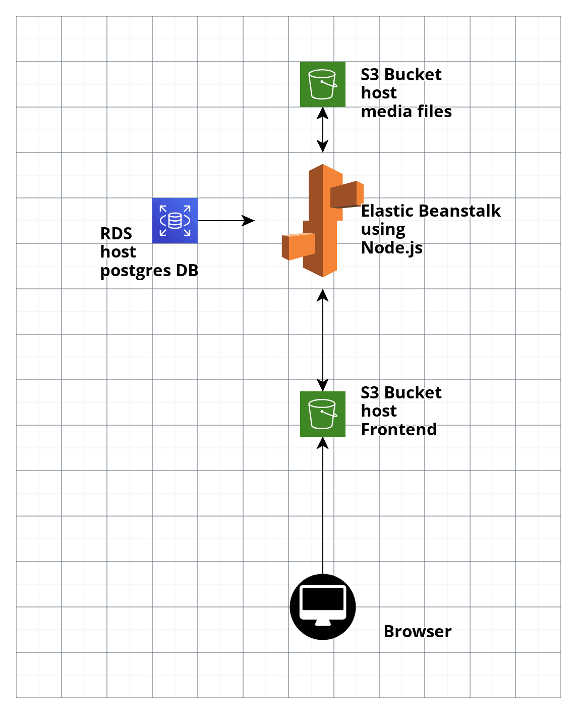

# Infrastructure

## AWS services
- **Elastic Beanstalk**
  - host the backend which is built using Node
- **RDS**
  - host PostgreSQL database
- **S3**
  - provides the frontend hosting
  - and backend media hosting

## diagram

